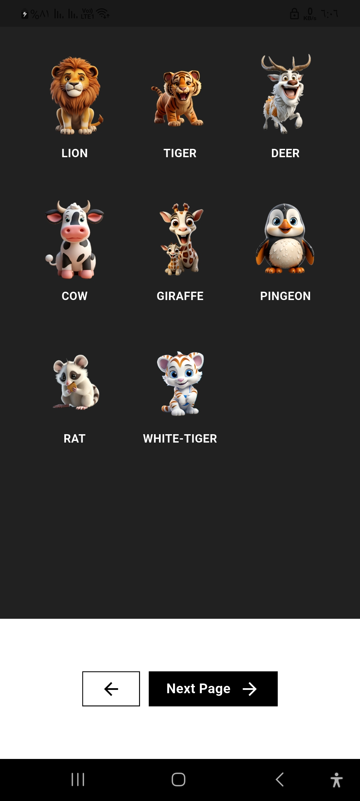

# 🎨 Flutter UI Designs & Logic Practice

A collection of Flutter UI exercises and challenges to practice various widgets, layouts, and design patterns.

## 📱 About The Project

This repository contains hands-on Flutter exercises focusing on practical UI/UX implementation. Each screen demonstrates different concepts and widget usage - from basic layouts to complex interactions.

### 🎥 Sample Screens

  

## ✨ What's Included

This practice project covers:

- **Grid & List Layouts**: Product galleries, animal selectors, paginated lists
- **File Handling**: Image picker, video upload, document selection (PDF/DOCX)
- **Form Validation**: Login forms with email/password validation and error handling
- **Interactive UI**: Multi-select chips, search & filter, category selection
- **Media Management**: Single/multiple image uploads, video preview, file operations
- **State Management**: Selection states, form states, toggle logic

## 🛠️ Built With

- **Flutter**: Mobile app framework
- **Dart**: Programming language
- **image_picker**: Image selection from gallery/camera
- **file_picker**: Document and file selection
- **Material Design**: UI components and styling

## 🏗️ Technical Highlights

**UI Patterns Implemented:**
- GridView and ListView with custom items
- Image galleries with thumbnails
- Form validation with real-time feedback
- Search bars with filtering logic
- Multi-select interfaces
- File upload with preview states
- Loading indicators and pagination

**Skills Demonstrated:**
- Responsive layout design
- Custom widget creation
- User input validation
- File/media handling
- Navigation between screens
- State management basics

## 💡 Use Cases

Perfect for:
- Learning Flutter UI development
- Practicing widget implementation
- Teaching material for Flutter courses
- Quick reference for common UI patterns

## 👨‍💻 Developer

**Isaac Gerges**
- GitHub: [@IsaacGerges](https://github.com/IsaacGerges)
- LinkedIn: [Isaac Gerges](https://linkedin.com/in/isaac-gerges-14405022b/)

### Skills Demonstrated
- Flutter UI/UX Implementation
- Material Design Principles
- Form Handling & Validation
- File & Media Management
- Responsive Design

---

**Note:** This is a practice/learning repository showcasing various Flutter UI implementations and design patterns.
